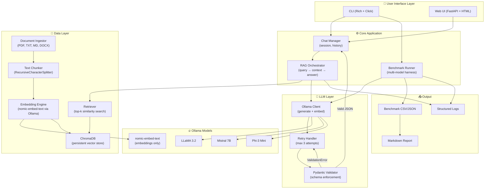

# 🏗️ Features & Architecture — Local AI Assistant

---

## 🗂️ Table of Contents
1. [Core Features (MVP)](#core-features)
2. [Advanced Features (Post-MVP)](#advanced-features)
3. [Stretch / Power Features](#stretch-features)
4. [System Architecture](#system-architecture)
5. [Data Flow Diagram](#data-flow)
6. [Component Breakdown](#component-breakdown)
7. [Technology Decisions](#technology-decisions)

---

## ✅ Core Features (MVP) {#core-features}

These are the **must-haves** that define the project.

### 📄 Document Management
| Feature | Description |
|---------|-------------|
| Multi-format upload | Accept `.pdf`, `.txt`, `.md`, `.docx` files |
| Chunking | Recursive character splitting with configurable chunk size & overlap |
| Metadata tagging | Store source filename, page number, chunk index per vector |
| Persistent storage | ChromaDB persists to disk — survives app restarts |
| Document listing | CLI command to see all indexed documents and chunk counts |

### 🤖 AI Chat / QA
| Feature | Description |
|---------|-------------|
| RAG-powered answers | Retrieves top-k relevant chunks before answering |
| Context-only mode | Model only answers from uploaded notes (no hallucination) |
| "I don't know" handling | Explicit fallback when context doesn't contain the answer |
| Multi-turn conversation | Maintain conversation history within a session |
| Source citation | Every answer cites which document chunk it came from |

### 🧱 Structured Output (Production Core)
| Feature | Description |
|---------|-------------|
| JSON schema enforcement | All model responses conform to Pydantic models |
| Retry with error feedback | Up to 3 retries, injecting validation errors as correction hints |
| Confidence scoring | Model outputs a 0–1 confidence value per answer |
| Reasoning field | Optional step-by-step reasoning trace from the model |

### 📊 Benchmarking
| Feature | Description |
|---------|-------------|
| 3-model comparison | Run LLaMA 3.2, Mistral, Phi-3 on identical question sets |
| Latency measurement | Per-query millisecond timing |
| RAM profiling | Before/after RAM delta per query using `psutil` |
| Success rate tracking | % of queries that produced valid structured output |
| Question categories | Factual, conceptual, application, multi-hop, out-of-context |
| CSV + JSON export | Machine-readable results for further analysis |
| Auto-generated report | Markdown benchmark table auto-built from results |

---

## 🚀 Advanced Features (Post-MVP) {#advanced-features}

Build these after your MVP is solid.

### 🔍 Smart Retrieval
| Feature | Description |
|---------|-------------|
| Hybrid search | Combine vector similarity + BM25 keyword search for better recall |
| Re-ranking | Use a cross-encoder to re-rank retrieved chunks by relevance |
| Query expansion | Auto-generate 2–3 query variants and merge results |
| Chunk deduplication | Detect and remove near-duplicate chunks at index time |
| Metadata filtering | Filter retrieval by source file ("only search lecture_3.pdf") |

### 📝 Study-Specific Features
| Feature | Description |
|---------|-------------|
| Flashcard generator | Auto-generate Q&A flashcard pairs from your notes |
| Summary generator | Produce a structured summary of any uploaded document |
| Quiz mode | Generate a 10-question quiz with MCQs from uploaded notes |
| Concept mapper | Extract key concepts and their relationships from a document |
| Weak area detector | Track which topics you answer with low confidence |

### 🛠️ System Features
| Feature | Description |
|---------|-------------|
| Model switching | Hot-swap models at runtime without restarting |
| Conversation history | Persist and reload previous chat sessions |
| Token usage tracking | Count prompt + completion tokens per query |
| Configuration file | `config.yaml` for all tunable parameters |
| Logging system | Structured JSON logs for every query + response |

### 🌐 Optional Web UI
| Feature | Description |
|---------|-------------|
| FastAPI backend | REST API wrapping all core functions |
| Chat interface | Browser-based chat with streaming responses |
| File upload UI | Drag-and-drop document upload with progress bar |
| Benchmark dashboard | Visual charts of benchmark results in browser |
| Source highlighting | Show exact retrieved chunks alongside the answer |

---

## ⚡ Stretch / Power Features {#stretch-features}

These would genuinely impress in interviews or on a portfolio.

| Feature | Why It's Impressive |
|---------|---------------------|
| **GGUF model loading** | Load custom quantized models directly, not just Ollama registry |
| **Answer evaluation with LLM-as-judge** | Use a second LLM call to rate the quality of answers (automated quality scoring) |
| **Adaptive chunking** | Dynamically adjust chunk size based on document type (dense textbook vs. bullet notes) |
| **Graph RAG** | Build a knowledge graph from notes and traverse it for multi-hop questions |
| **Voice interface** | `whisper.cpp` for STT + `pyttsx3` for TTS — fully local voice assistant |
| **Multi-modal** | Support image extraction from PDFs using `pymupdf` + describe diagrams |
| **A/B test framework** | Run the same prompt through two models simultaneously and compare |
| **Prompt version control** | Track prompt template changes and their effect on benchmark scores |

---

## 🏛️ System Architecture {#system-architecture}



---

## 🌊 Data Flow Diagram {#data-flow}

### Flow A — Document Ingestion
```
📁 User uploads file
        │
        ▼
┌───────────────────┐
│  Document Loader  │  (langchain loaders per file type)
└───────────────────┘
        │
        ▼
┌───────────────────┐
│   Text Chunker    │  chunk_size=500, overlap=50
└───────────────────┘
        │ list of chunks + metadata
        ▼
┌───────────────────┐
│ Embedding Engine  │  nomic-embed-text via Ollama
└───────────────────┘
        │ vector embeddings
        ▼
┌───────────────────┐
│    ChromaDB       │  persisted to disk
└───────────────────┘
        │
        ✅ "42 chunks indexed from lecture_3.pdf"
```

### Flow B — User Query (RAG)
```
💬 User asks: "What is backpropagation?"
        │
        ▼
┌───────────────────┐
│  Query Embedding  │  same nomic-embed-text model
└───────────────────┘
        │
        ▼
┌───────────────────┐
│  ChromaDB Search  │  top-5 similar chunks returned
└───────────────────┘
        │ context string assembled
        ▼
┌───────────────────┐
│  Prompt Builder   │  system + context + question
└───────────────────┘
        │
        ▼
┌───────────────────┐
│   Ollama LLM      │  selected model generates response
└───────────────────┘
        │ raw text (may contain JSON in code fence)
        ▼
┌───────────────────┐
│  JSON Extractor   │  strips markdown fences
└───────────────────┘
        │
        ▼
┌───────────────────┐
│ Pydantic Validate │
└───────────────────┘
        │           │
    ✅ Valid    ❌ Invalid
        │           │
        │     ┌─────▼────────┐
        │     │ Retry Loop   │  inject error, re-prompt
        │     │ (max 3x)     │
        │     └─────┬────────┘
        │           │ still invalid after 3x
        │     ┌─────▼────────┐
        │     │ Raise Error  │
        │     └──────────────┘
        ▼
┌───────────────────┐
│  AnswerResponse   │  answer + confidence + sources
└───────────────────┘
        │
        ✅ Displayed to user with citations
```

### Flow C — Benchmark Run
```
🏁 benchmark run --models llama3.2,mistral,phi3 --questions all

For each model × each question:
  1. Start RAM measurement (psutil)
  2. Start timer (perf_counter)
  3. Run Flow B (RAG Query)
  4. Stop timer → latency_ms
  5. Stop RAM → ram_delta_mb
  6. Record: retries, success, confidence
  7. Append BenchmarkResult to list

After all runs:
  → Save to benchmark_results/run_001.csv
  → Auto-generate benchmark_report.md
  → Print summary table to terminal
```

---

## 🧩 Component Breakdown {#component-breakdown}

### `app/config.py`
- All magic numbers in one place: model names, chunk size, top-k, max retries, DB path
- Load from `config.yaml` with environment variable overrides

### `app/models/schemas.py`
- `AnswerResponse` — the standard QA output
- `BenchmarkResult` — one row of benchmark data
- `DocumentChunk` — metadata for a stored chunk
- `ConversationTurn` — one Q&A pair in history

### `app/rag/ingestion.py`
- `ingest_file(path: str) -> int` — returns number of chunks stored
- `list_documents() -> List[DocumentInfo]`
- `delete_document(source: str)`

### `app/rag/retriever.py`
- `retrieve(query: str, k: int = 5) -> List[DocumentChunk]`
- `assemble_context(chunks: List[DocumentChunk]) -> str`

### `app/llm/client.py`
- `generate(model, prompt) -> str` — raw Ollama call
- `embed(text) -> List[float]` — embedding call
- `query_structured(model, prompt, schema, max_retries) -> BaseModel`

### `app/llm/prompts.py`
- `build_rag_prompt(context, question, history) -> str`
- `build_correction_prompt(original, error) -> str`

### `app/benchmark/runner.py`
- `run_benchmark(models, questions) -> List[BenchmarkResult]`
- `save_results(results, path)`

### `app/benchmark/report.py`
- `generate_markdown_table(results) -> str`
- `generate_charts(results)` — saves PNG files

### `app/cli/main.py`
- Click command group with commands: `ask`, `upload`, `list-docs`, `benchmark`, `switch-model`, `history`

---

## 🔬 Technology Decisions {#technology-decisions}

| Decision | Choice | Why |
|----------|--------|-----|
| LLM runtime | **Ollama** | Easiest local model serving, GPU/CPU auto-detect |
| Vector DB | **ChromaDB** | Zero-config, persistent, Python-native |
| Embeddings | **nomic-embed-text** | Best local embedding model, runs in Ollama |
| Data validation | **Pydantic v2** | Industry standard, fast, great error messages |
| CLI framework | **Click + Rich** | Beautiful terminal output, easy command routing |
| Model 1 | **LLaMA 3.2 (3B)** | Best open-source reasoning, Meta's flagship |
| Model 2 | **Mistral 7B** | Extremely capable, fast inference |
| Model 3 | **Phi-3 Mini (3.8B)** | Microsoft's efficiency king, tiny but smart |
| Document loading | **LangChain Community** | Battle-tested loaders for all file types |
| RAM profiling | **psutil** | Cross-platform, no external dependencies |

---

## 📦 Final File Structure

```
OfflineAiAsistant/
│
├── app/
│   ├── __init__.py
│   ├── config.py                    # Centralized config
│   │
│   ├── models/
│   │   ├── __init__.py
│   │   └── schemas.py               # All Pydantic models
│   │
│   ├── rag/
│   │   ├── __init__.py
│   │   ├── ingestion.py             # File → chunks → ChromaDB
│   │   ├── retriever.py             # Query → top-k chunks
│   │   └── vectorstore.py           # ChromaDB client wrapper
│   │
│   ├── llm/
│   │   ├── __init__.py
│   │   ├── client.py                # Ollama API wrapper + retry logic
│   │   └── prompts.py               # Prompt templates
│   │
│   ├── benchmark/
│   │   ├── __init__.py
│   │   ├── questions.py             # 35-question bank
│   │   ├── runner.py                # Multi-model benchmark harness
│   │   └── report.py               # Markdown + chart generation
│   │
│   └── cli/
│       ├── __init__.py
│       └── main.py                  # Click CLI entrypoint
│
├── data/
│   ├── raw/                         # Drop your notes here
│   └── chroma_db/                   # Auto-created by ChromaDB
│
├── benchmark_results/               # Auto-created on first benchmark run
│   ├── run_001.csv
│   ├── run_001.json
│   └── benchmark_report.md
│
├── tests/
│   ├── test_schemas.py
│   ├── test_retrieval.py
│   ├── test_retry_logic.py
│   └── test_benchmark.py
│
├── config.yaml                      # User-editable settings
├── requirements.txt
├── .env.example
└── README.md
```
